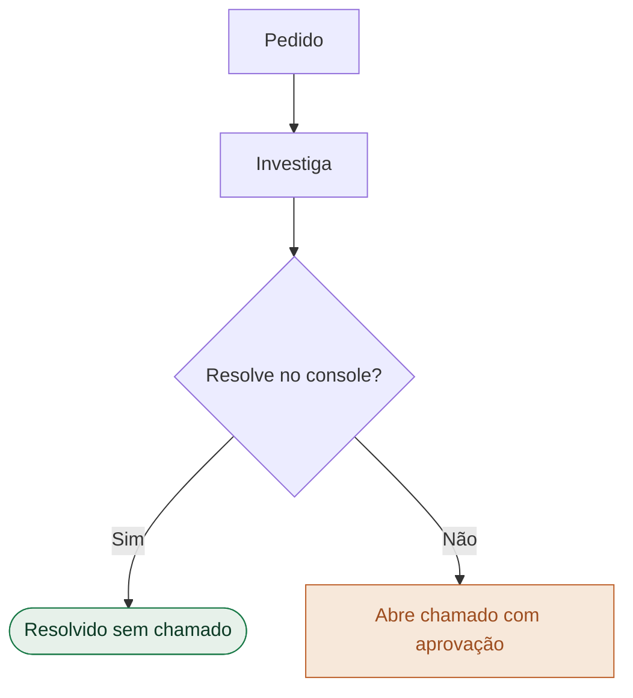
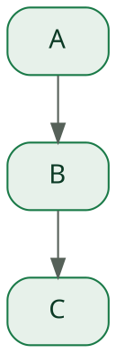

# Diagramas — Mermaid & Graphviz no padrão Forest Editorial

## 1. Tema Mermaid da marca
O motor HTML já inicializa o Mermaid com o tema verde-floresta (em `build.py` → RUNTIME).
Para Marp/Quarto, use os mesmos `classDef`/cores. Config canônica:
```js
mermaid.initialize({ startOnLoad:false, securityLevel:'loose', theme:'base',
  fontFamily:'IBM Plex Sans, sans-serif',
  flowchart:{ useMaxWidth:false, htmlLabels:true, curve:'basis', nodeSpacing:40, rankSpacing:46 },
  sequence:{ useMaxWidth:false, mirrorActors:false, boxMargin:8 },
  themeVariables:{
    primaryColor:'#e7f1ea', primaryTextColor:'#0c3a25', primaryBorderColor:'#1a7a48',
    lineColor:'#566159', secondaryColor:'#f7e8da', tertiaryColor:'#ffffff',
    actorBkg:'#0c3a25', actorTextColor:'#f4efe4', actorBorder:'#1a7a48',
    noteBkgColor:'#f7e8da', noteTextColor:'#9d4d1f', noteBorderColor:'#ecc8a8' }});
```

## 2. Regras de layout
- **Prefira `flowchart TD`** (vertical) a `LR` — `LR` vira uma faixa larga e fina que
  desperdiça o slide 16:9. Se precisar de largura, limite a profundidade.
- `useMaxWidth:false` + no CSS `.mermaid svg{max-width:100%;max-height:100%;width:auto;height:auto}`
  para o diagrama caber na `.diagram` sem distorcer.
- Estados de sucesso em verde, de escalonamento/risco em terracota:

- **Sequence:** `actor`/`participant`; atores em verde-escuro (`actorBkg #0c3a25`).

## 3. Por motor
- **HTML:** `<div class="diagram" style="height:430px"><pre class="mermaid">…</pre></div>` — render nativo no browser/PDF.
- **Quarto:** bloco ```` ```{mermaid} ```` (nativo, vira SVG) ou ```` ```{dot} ```` (Graphviz). Use `classDef` com as cores acima.
- **Marp:** **sem Mermaid nativo** → `./build.sh --mermaid deck.md` pré-renderiza blocos ```` ```mermaid ```` em imagem (via `@mermaid-js/mermaid-cli`), ou exporte o SVG/PNG e inclua como ``.

## 4. Graphviz (Quarto)


## 5. QA
- [ ] Cabe na moldura sem corte nem distorção (TD, `useMaxWidth:false`)
- [ ] Cores e fontes da marca; sucesso verde / risco terracota
- [ ] Rótulos legíveis (sem overflow); rótulos de aresta curtos
- [ ] No PDF: diagrama renderizou (esperar `__ready` no motor HTML)
